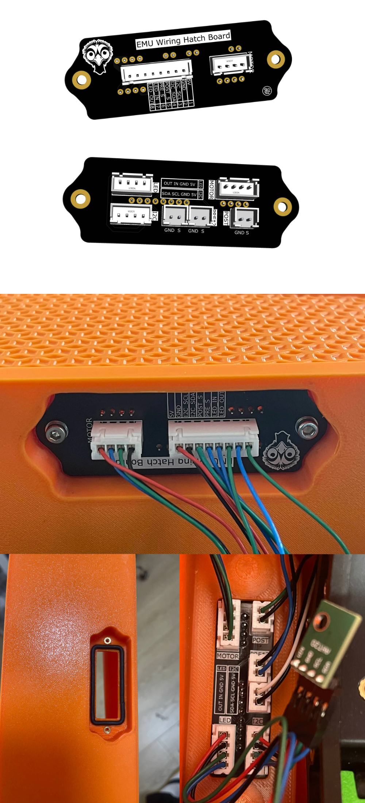

## EMU Wiring Hatch Board

**EMU Wiring Hatch Board** is an improved PCB designed for EMU, making wiring and assembly easier and more convenient.

## Features

1. **No need to solder wires directly on JST connectors**  
   - Simplifies assembly and reduces soldering risks.

2. **Optimized Pre Switches connection**  
   - The two pre switches no longer need to be soldered in parallel. You can solder wires to each switch first, then install them individually on this board.

3. **Sealing remains effective**  
   - The sealing ring has been moved to the box, with the seal remaining just as effective.

## License

All design files and documentation are the property of the **EMU project**.  

