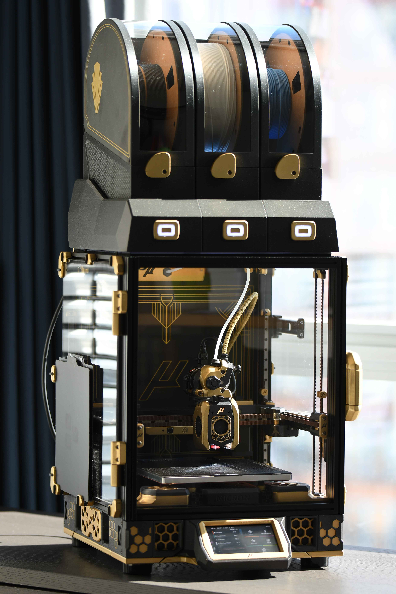

# Micron EMU hat

This mod replaces the base units to fit three boxes onto a Micron in *stealth* aesthetic. It mounts to the top extrusions using four screws, requiring post-loading of two nuts per front-to-back top extrusion.

Print using upstream settings, including painting fuzzy skin.

## Acknowledgements

Many thanks to @hartk for providing the rough-cut of the Micron EMU base. @burkfers cut the button holes, did diverse polishing, and tested.

## Showcase

M.239 wearing EMU.0012 as a hat by @TheMeanCanEHdian

